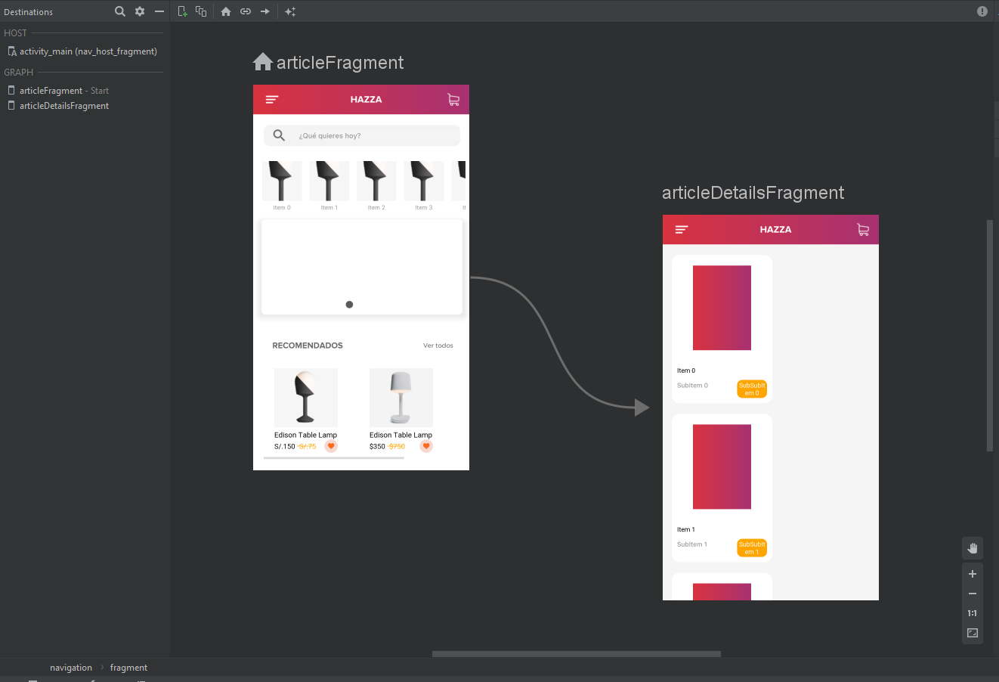

# Hazza_MVVM (Clean_Architecture)

## La aplicación tiene los siguientes paquetes:
1. **data**: Contiene todos los componentes de acceso y manipulación de datos.
2. **di**: Dependencia que proporciona clases usando Dagger2.
3. **ui**: Ver clases junto con sus presentadores correspondientes.
4. **utils**: Clases de utilidad.

## Navigation Component Graph
<p align="center">
    
</p>
<br>

## Guía de arquitectura de la aplicación
<p align="center">
    
</p>
<br>

## Librerias referenciadas:
1. RxJava2: https://github.com/ReactiveX/RxJava
2. RxAndroid: https://github.com/ReactiveX/RxAndroid
3. Dagger2: https://github.com/MindorksOpenSource/android-dagger2-example
4. Retrofit: https://square.github.io/retrofit/
5. Room: https://developer.android.com/topic/libraries/architecture/room.html
6. AndroidDebugDatabase: https://github.com/amitshekhariitbhu/Android-Debug-Database
7. DataBinding: https://developer.android.com/topic/libraries/data-binding
8. Navigation Component: https://developer.android.com/guide/navigation/navigation-getting-started
<br>

```
